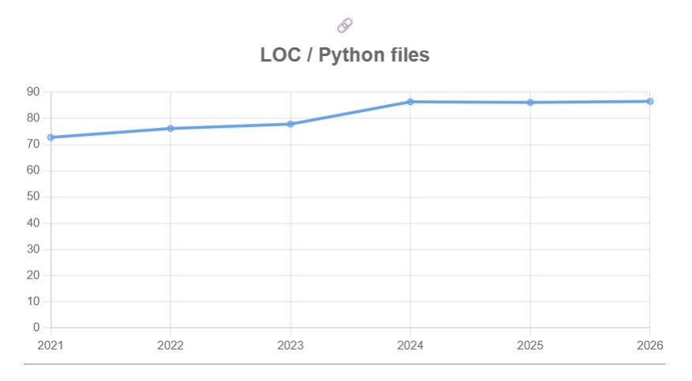

Repositório selecionado: https://github.com/TheAlgorithms/Python  
Gráfico selecionado:   
  
Explicação: de modo geral, houve um aumento de cerca de 84% no número de linhas de código do repositório e um aumento de cerca de 20% em linhas de código por aquivo, com o valor absoluto se estabilizando nos últimos 3 anos. além disso, em números absolutos, a quantidade de linhas de código por arquivo é ~86, o que mostra que os arquivos não são muito grandes.  

buscando possíveis explicações para o aumento de loc por arquivo, procurei as issues mais populares já fechadas do repo e uma chamada "Improve our test coverage" (a segunda mais popular) me chamou a atenção. na própria descrição da issue, um trecho diz que "A doctest is a unit test that is contained within the documentation comment (docstring) for a function", ou seja, o teste fica dentro da própria função. os PRs para essa issue foram aceitos no ano de 2023, o que coincide com o aumento mais expressivo de loc por aquivo, sendo assim uma possível justificativa para o aumento dessa métrica, o que indica que apesar do seu aumento, isso não significa automaticamente um sinal de má prática.  

além disso, utilizando como base os gráficos, outras possíveis explicações para o aumento de LOC por arquivo podem ser:
- aumento de typed_parameters e return types que podem ter causado mais line breaks em funções com muitos parâmetros.
- aumento de raise_statements onde mais raise exceptions significam mais trativas de erro, o que pode aumentar loc por arquivo.  

ambas também não representam má prática.